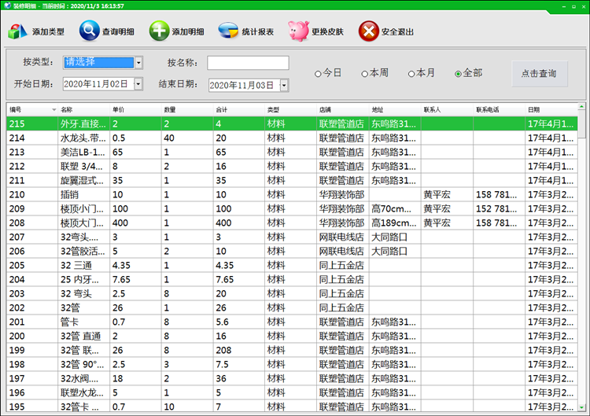
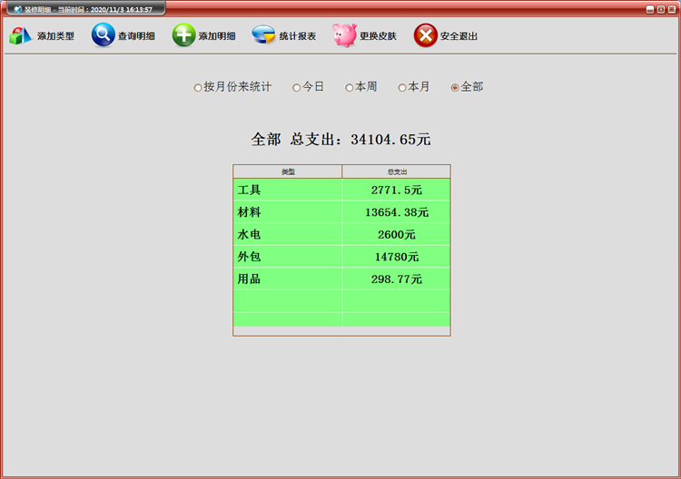

# 装修记账工具
### 开发语言：C#
### 开发工具：Microsoft Visual Studio 2010
## 软件简述：
装修记账工具是一款用于记录装修费用的软件，专注于装修记账领域的记账应用，对各种繁杂的装修消费进行明确管理，帮你严格控制装修花费，让每一分钱都花在最实用的地方！
## 使用说明：
1. 数据永久保存于Microsoft Office Access Database文件里，因此使用本工具需要先安装Microsoft Office Access。
2. 可自定义添加分类，支持按日/周/月进行查询和统计，操作简单，记账方便！
## 软件截图：

